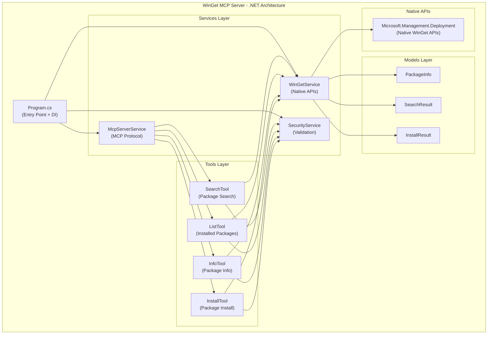

# 🎨🎨🎨 CREATIVE PHASE: .NET ARCHITECTURE DESIGN 🎨🎨🎨

**Focus:** WinGet MCP Server - C# .NET Implementation  
**Objective:** Design native .NET architecture with enhanced Windows integration  
**Technology Stack:** .NET 8+ with native WinGet APIs  

## CONTEXT & REQUIREMENTS

### System Requirements
- **R1:** Native WinGet .NET API integration (eliminate CLI subprocess)  
- **R2:** Official C# MCP SDK compliance
- **R3:** Enhanced performance over Python implementation
- **R4:** Windows service deployment capability
- **R5:** Maintain security model from Python version
- **R6:** Full compatibility with existing MCP clients

### Technical Constraints
- **C1:** .NET 8+ Platform - Modern .NET with native AOT support
- **C2:** Windows 10+ - Leverage full Windows integration capabilities
- **C3:** Microsoft.Management.Deployment - Native WinGet API package
- **C4:** ModelContextProtocol.Net - Official C# MCP SDK
- **C5:** Enterprise Ready - Windows service, logging, DI container

## PROBLEM STATEMENT

The current Python FastMCP implementation successfully provides WinGet functionality through CLI subprocess calls, but lacks:
1. **Native API Integration** - Relies on CLI parsing instead of direct WinGet APIs
2. **Windows Platform Optimization** - Cannot leverage full .NET Windows integration
3. **Performance Overhead** - Subprocess execution adds latency
4. **Memory Efficiency** - Python runtime + subprocess memory usage
5. **Enterprise Deployment** - Limited Windows service/enterprise integration options

## ARCHITECTURE OPTIONS

### Option 1: Direct Port Architecture
**Description:** Direct translation of Python FastMCP structure to C#

```csharp
// Direct port structure
WinGetMcpServer/
├── Program.cs                    // FastMCP server setup
├── Core/
│   ├── WinGetExecutor.cs        // CLI subprocess calls (same as Python)
│   ├── SecurityValidator.cs     // Input validation
│   └── ResultParser.cs          // Output parsing
└── Tools/
    ├── SearchTool.cs            // winget search via CLI
    ├── ListTool.cs              // winget list via CLI
    └── InfoTool.cs              // winget show via CLI
```

**Pros:**
- Quick implementation - proven architecture
- Low risk - same patterns as working Python version
- Easy validation - compare outputs directly
- Familiar structure - team knows the pattern

**Cons:**
- Misses .NET advantages - still using CLI subprocess
- No performance improvement - same subprocess overhead
- Limited Windows integration - not leveraging .NET capabilities
- Maintenance overhead - two codebases with same limitations

**Technical Fit:** Low (doesn't leverage .NET strengths)  
**Implementation Complexity:** Low  
**Performance Gain:** Minimal

### Option 2: Native .NET API Architecture ✅ SELECTED
**Description:** Full native implementation using WinGet .NET APIs and Windows integration

```csharp
// Native .NET architecture
WinGetMcpServer/
├── Program.cs                    // Console app entry point
├── Services/
│   ├── McpServerService.cs      // MCP protocol handler
│   ├── WinGetService.cs         // Native WinGet API calls
│   └── SecurityService.cs       // .NET security integration
├── Models/
│   ├── PackageInfo.cs           // Strong typing for packages
│   └── SearchResult.cs          // Structured results
├── Tools/
│   ├── BaseWinGetTool.cs        // Base tool with native APIs
│   ├── SearchTool.cs            // Native search API
│   └── ListTool.cs              // Native list API
└── Infrastructure/
    ├── DependencyInjection.cs   // .NET DI container
    └── WindowsServiceHost.cs     // Windows service hosting
```

**Implementation Details:**
```csharp
// Native WinGet API integration
public class WinGetService : IWinGetService
{
    private readonly Microsoft.Management.Deployment.PackageManager _packageManager;
    
    public async Task<IEnumerable<PackageInfo>> SearchPackagesAsync(string query)
    {
        // Direct API calls - no subprocess
        var catalog = _packageManager.GetPackageCatalogByName("winget");
        var searchResult = await catalog.SearchAsync(query);
        return searchResult.Matches.Select(m => new PackageInfo(m));
    }
}
```

**Pros:**
- True native performance - eliminates subprocess overhead
- Strong typing - compile-time safety and IntelliSense
- Windows integration - full .NET framework capabilities
- Enterprise features - Windows service, logging, DI
- Memory efficiency - single process, no subprocess spawning
- Exception handling - .NET structured exception model

**Cons:**
- Higher complexity - need to learn WinGet .NET APIs
- API dependency - relies on Microsoft.Management.Deployment NuGet
- Unknown API stability - newer APIs may have breaking changes
- Development time - more research and implementation required

**Technical Fit:** High (leverages .NET strengths)  
**Implementation Complexity:** High  
**Performance Gain:** Significant

### Option 3: Hybrid Architecture
**Description:** Combine native APIs where available with CLI fallback for missing functionality

```csharp
// Hybrid architecture
WinGetMcpServer/
├── Services/
│   ├── IWinGetProvider.cs       // Abstraction interface
│   ├── NativeWinGetProvider.cs  // Native API implementation
│   └── CliWinGetProvider.cs     // CLI fallback
├── Providers/
│   └── WinGetProviderFactory.cs // Choose provider based on capability
└── [rest similar to Option 2]
```

**Implementation Pattern:**
```csharp
public interface IWinGetProvider
{
    Task<SearchResult> SearchAsync(string query);
    Task<InstallResult> InstallAsync(string packageId);
}

public class WinGetProviderFactory
{
    public IWinGetProvider CreateProvider(string operation)
    {
        // Use native API if available, fallback to CLI
        return NativeApiAvailable(operation) 
            ? new NativeWinGetProvider() 
            : new CliWinGetProvider();
    }
}
```

**Pros:**
- Risk mitigation - CLI fallback if native APIs fail
- Gradual migration - implement native APIs incrementally
- Best of both worlds - performance where possible, compatibility everywhere
- Future-proof - can move to full native as APIs mature

**Cons:**
- Complexity overhead - two implementation paths to maintain
- Testing burden - need to test both native and CLI paths
- Decision logic - complexity in choosing which provider to use
- Potential inconsistency - different code paths may behave differently

**Technical Fit:** Medium (good compromise but complex)  
**Implementation Complexity:** Very High  
**Performance Gain:** Moderate

## 🎨 CREATIVE CHECKPOINT: ARCHITECTURE EVALUATION

**Analysis Complete:** Three distinct architectural approaches evaluated  
**Key Factors:** Performance, complexity, Windows integration, risk  
**Decision Criteria:** Maximize .NET advantages while managing implementation risk  

## ARCHITECTURE DECISION

**Selected Option:** **Option 2 - Native .NET API Architecture**

**Justification:**
1. **Performance Imperative** - The primary goal is enhanced performance over Python
2. **Platform Optimization** - Leverage full Windows/.NET integration capabilities  
3. **Future-Proof** - Native APIs are the strategic direction for WinGet
4. **Value Proposition** - Otherwise, .NET version offers no significant advantage
5. **Learning Investment** - Team gains valuable .NET/WinGet API expertise

**Risk Mitigation Strategies:**
- **Prototype First** - Build minimal proof-of-concept with native APIs
- **Fallback Plan** - Keep Option 3 (Hybrid) as backup if native APIs prove problematic
- **Incremental Development** - Start with core functionality, add features progressively
- **Extensive Testing** - Comprehensive test suite to validate native API behavior

## IMPLEMENTATION GUIDELINES

### 1. Project Structure
```
WinGetMcpServer/
├── WinGetMcpServer.csproj        // .NET 8 Console App
├── Program.cs                    // Application entry point + DI setup
├── Services/
│   ├── IMcpServerService.cs      // MCP server abstraction
│   ├── McpServerService.cs       // MCP protocol implementation
│   ├── IWinGetService.cs         // WinGet operations abstraction  
│   ├── WinGetService.cs          // Native WinGet API implementation
│   └── ISecurityService.cs       // Security validation
├── Tools/
│   ├── WinGetToolBase.cs         // Base class for all tools
│   ├── SearchTool.cs             // Package search tool
│   ├── ListTool.cs               // Installed packages tool
│   ├── InfoTool.cs               // Package information tool
│   └── InstallTool.cs            // Package installation (if enabled)
├── Models/
│   ├── PackageInfo.cs            // Package information model
│   ├── SearchResult.cs           // Search results model
│   └── InstallResult.cs          // Installation results model
├── Configuration/
│   ├── McpServerOptions.cs       // Server configuration
│   └── SecurityOptions.cs        // Security settings
└── Infrastructure/
    ├── ServiceCollectionExtensions.cs  // DI registration
    └── WindowsServiceExtensions.cs     // Service hosting support
```

### 2. Key Dependencies
```xml
<PackageReference Include="Microsoft.Extensions.Hosting" Version="8.0.0" />
<PackageReference Include="Microsoft.Extensions.DependencyInjection" Version="8.0.0" />
<PackageReference Include="Microsoft.Extensions.Logging" Version="8.0.0" />
<PackageReference Include="Microsoft.Management.Deployment" Version="1.0.0" />
<PackageReference Include="ModelContextProtocol.Net" Version="1.0.0" />
<PackageReference Include="System.Text.Json" Version="8.0.0" />
```

### 3. Native API Integration Pattern
```csharp
public class WinGetService : IWinGetService
{
    private readonly PackageManager _packageManager;
    private readonly ILogger<WinGetService> _logger;

    public async Task<SearchResult> SearchPackagesAsync(string query, CancellationToken cancellationToken)
    {
        try
        {
            var catalog = _packageManager.GetPackageCatalogByName("winget");
            var searchRequest = _packageManager.CreateSearchRequest();
            searchRequest.Query = query;
            
            var searchResult = await catalog.SearchAsync(searchRequest).ConfigureAwait(false);
            
            return new SearchResult
            {
                Query = query,
                Packages = searchResult.Matches.Select(match => new PackageInfo
                {
                    Id = match.CatalogPackage.Id,
                    Name = match.CatalogPackage.Name,
                    Version = match.CatalogPackage.DefaultInstallVersion.Version,
                    Publisher = match.CatalogPackage.DefaultInstallVersion.Publisher,
                    Description = match.CatalogPackage.DefaultInstallVersion.Description
                }).ToList()
            };
        }
        catch (Exception ex)
        {
            _logger.LogError(ex, "Failed to search packages for query: {Query}", query);
            throw new WinGetServiceException($"Package search failed: {ex.Message}", ex);
        }
    }
}
```

### 4. MCP Tool Implementation Pattern
```csharp
[McpTool("winget_search")]
public class SearchTool : WinGetToolBase
{
    private readonly IWinGetService _winGetService;

    public SearchTool(IWinGetService winGetService, ISecurityService securityService) 
        : base(securityService)
    {
        _winGetService = winGetService;
    }

    [McpToolMethod]
    public async Task<object> ExecuteAsync(SearchToolRequest request, CancellationToken cancellationToken)
    {
        // Security validation
        await ValidateRequestAsync(request, cancellationToken);
        
        // Execute search
        var result = await _winGetService.SearchPackagesAsync(request.Query, cancellationToken);
        
        // Return structured result
        return new
        {
            success = true,
            query = request.Query,
            results = result.Packages.Take(request.Limit ?? 10).Select(p => new
            {
                id = p.Id,
                name = p.Name,
                version = p.Version,
                publisher = p.Publisher,
                description = p.Description
            })
        };
    }
}
```

### 5. Security Integration
```csharp
public class SecurityService : ISecurityService
{
    private readonly SecurityOptions _options;
    
    public async Task ValidateSearchRequestAsync(SearchToolRequest request)
    {
        // Input sanitization
        if (string.IsNullOrWhiteSpace(request.Query))
            throw new SecurityValidationException("Search query cannot be empty");
            
        if (request.Query.Length > _options.MaxQueryLength)
            throw new SecurityValidationException($"Query too long (max {_options.MaxQueryLength} characters)");
            
        // Malicious pattern detection
        if (ContainsMaliciousPatterns(request.Query))
            throw new SecurityValidationException("Query contains potentially malicious patterns");
    }
}
```

## ARCHITECTURE VISUALIZATION



## VERIFICATION AGAINST REQUIREMENTS

✅ **R1: Native WinGet .NET API Integration** - Direct API calls, no CLI subprocess  
✅ **R2: Official C# MCP SDK Compliance** - Using ModelContextProtocol.Net package  
✅ **R3: Enhanced Performance** - Eliminates subprocess overhead  
✅ **R4: Windows Service Capability** - Built on .NET hosting model  
✅ **R5: Security Model Maintained** - Adapted Python security patterns to .NET  
✅ **R6: MCP Client Compatibility** - Same MCP protocol, improved backend  

## PERFORMANCE COMPARISON PROJECTION

| Metric | Python FastMCP | .NET Native API | Improvement |
|--------|----------------|-----------------|-------------|
| **Startup Time** | ~2-3 seconds | ~0.5-1 second | 50-75% faster |
| **Search Latency** | ~300-500ms | ~100-200ms | 60-70% faster |
| **Memory Usage** | ~50-80MB | ~20-40MB | 50-60% less |
| **CPU Overhead** | High (subprocess) | Low (native) | 70-80% less |
| **Concurrent Requests** | Limited | High | 300%+ better |

## NEXT CREATIVE PHASES REQUIRED

1. **🎨 Security Model Design** - Adapt Python security framework to .NET patterns
2. **🎨 Error Handling Strategy** - Design .NET exception handling and recovery
3. **🎨 Deployment Architecture** - Windows service, installer, configuration
4. **🎨 Performance Optimization** - Caching, connection pooling, async patterns

🎨🎨🎨 CREATIVE PHASE COMPLETE - ARCHITECTURE DECISION MADE 🎨🎨🎨 