# 🎨🎨🎨 CREATIVE PHASE: .NET SECURITY MODEL DESIGN 🎨🎨🎨

**Focus:** Security Framework for .NET MCP Server  
**Objective:** Design comprehensive security framework leveraging .NET security features  
**Context:** Adapt Python security model to .NET patterns with enhanced Windows integration  

## PROBLEM STATEMENT

The Python implementation has a proven security model, but the .NET version needs to:
1. **Leverage .NET Security Features** - Use built-in .NET security mechanisms
2. **Windows Integration** - Integrate with Windows security and user context
3. **Native API Security** - Secure native WinGet API calls (different from CLI)
4. **Performance Optimization** - Security validation without performance penalty
5. **Enterprise Compliance** - Support Windows enterprise security policies

## SECURITY OPTIONS ANALYSIS

### Option 1: Direct Port Security Model
**Description:** Translate Python security patterns directly to C#

```csharp
// Direct port approach
public class SecurityValidator
{
    public bool ValidateCommand(string command, string[] args)
    {
        // Simple whitelist check (same as Python)
        var allowedCommands = new[] { "search", "list", "show", "info" };
        return allowedCommands.Contains(command);
    }
}
```

**Pros:**
- Quick implementation - proven security model
- Low risk - same validation logic as Python
- Easy to compare - direct feature parity

**Cons:**
- Misses .NET security advantages
- No Windows integration
- Basic validation only
- No enterprise features

**Technical Fit:** Low (doesn't leverage .NET strengths)  
**Security Coverage:** Basic  
**Enterprise Ready:** No

### Option 2: .NET-Native Security Framework ✅ SELECTED
**Description:** Comprehensive security framework leveraging .NET and Windows features

```csharp
// .NET security framework
public class SecurityService : ISecurityService
{
    private readonly SecurityOptions _options;
    private readonly IWindowsIdentityService _identityService;
    private readonly ISecurityPolicyService _policyService;
    
    // Multi-layer validation
    public async Task<ValidationResult> ValidateRequestAsync(McpToolRequest request)
    {
        // Layer 1: User context validation
        await ValidateUserContextAsync();
        
        // Layer 2: Request validation
        await ValidateRequestStructureAsync(request);
        
        // Layer 3: Permission validation
        await ValidatePermissionsAsync(request);
        
        // Layer 4: Content validation
        await ValidateContentAsync(request);
        
        return ValidationResult.Success();
    }
}
```

**Pros:**
- Full .NET integration - leverages framework security
- Windows user context - integrates with Windows security
- Comprehensive validation - multi-layer security
- Enterprise ready - policy integration
- Performance optimized - compiled security rules

**Cons:**
- Higher complexity - requires .NET security knowledge
- More dependencies - Windows security APIs
- Implementation time - comprehensive framework

**Technical Fit:** High (leverages .NET strengths)  
**Security Coverage:** Comprehensive  
**Enterprise Ready:** Yes

### Option 3: Hybrid Security Model  
**Description:** Combine .NET security with external security providers

**Pros:**
- Flexible security providers
- Enterprise integration options
- Extensible architecture

**Cons:**
- Over-engineered for current scope
- Complex configuration
- Additional dependencies

**Technical Fit:** Medium (good but complex)  
**Security Coverage:** Comprehensive  
**Enterprise Ready:** Yes

## 🎨 CREATIVE CHECKPOINT: SECURITY EVALUATION

**Analysis Complete:** Three security approaches evaluated  
**Key Factors:** .NET integration, Windows features, enterprise compliance  
**Decision Criteria:** Balance comprehensive security with implementation practicality  

## SECURITY DECISION

**Selected Option:** **Option 2 - .NET-Native Security Framework**

**Justification:**
1. **Platform Optimization** - Leverage full .NET security capabilities
2. **Windows Integration** - Native Windows user context and policies
3. **Performance** - Compiled security rules and caching
4. **Enterprise Readiness** - Support for Windows enterprise environments
5. **Future-Proof** - Extensible framework for additional security features

## SECURITY IMPLEMENTATION DESIGN

### 1. Multi-Layer Security Architecture

```csharp
public interface ISecurityService
{
    Task<ValidationResult> ValidateRequestAsync(McpToolRequest request, CancellationToken cancellationToken);
    Task<bool> IsUserAuthorizedAsync(string operation, CancellationToken cancellationToken);
    Task<SecurityContext> GetSecurityContextAsync(CancellationToken cancellationToken);
}

public class SecurityService : ISecurityService
{
    private readonly SecurityOptions _options;
    private readonly IWindowsIdentityService _identityService;
    private readonly ISecurityPolicyService _policyService;
    private readonly ILogger<SecurityService> _logger;
    private readonly IMemoryCache _validationCache;

    public async Task<ValidationResult> ValidateRequestAsync(McpToolRequest request, CancellationToken cancellationToken)
    {
        var context = await GetSecurityContextAsync(cancellationToken);
        
        // Layer 1: User Context Validation
        var userValidation = await ValidateUserContextAsync(context, cancellationToken);
        if (!userValidation.IsValid)
            return userValidation;
        
        // Layer 2: Request Structure Validation
        var structureValidation = ValidateRequestStructure(request);
        if (!structureValidation.IsValid)
            return structureValidation;
        
        // Layer 3: Permission Validation
        var permissionValidation = await ValidatePermissionsAsync(request, context, cancellationToken);
        if (!permissionValidation.IsValid)
            return permissionValidation;
        
        // Layer 4: Content Validation
        var contentValidation = await ValidateContentAsync(request, cancellationToken);
        if (!contentValidation.IsValid)
            return contentValidation;
        
        // Layer 5: Rate Limiting
        var rateLimitValidation = await ValidateRateLimitAsync(context, cancellationToken);
        if (!rateLimitValidation.IsValid)
            return rateLimitValidation;
        
        return ValidationResult.Success();
    }
}
```

### 2. Windows Integration Security

```csharp
public interface IWindowsIdentityService
{
    Task<WindowsIdentity> GetCurrentIdentityAsync();
    Task<bool> IsElevatedAsync();
    Task<bool> HasPermissionAsync(string permission);
    Task<SecurityContext> CreateSecurityContextAsync();
}

public class WindowsIdentityService : IWindowsIdentityService
{
    public async Task<WindowsIdentity> GetCurrentIdentityAsync()
    {
        return WindowsIdentity.GetCurrent();
    }
    
    public async Task<bool> IsElevatedAsync()
    {
        using var identity = WindowsIdentity.GetCurrent();
        var principal = new WindowsPrincipal(identity);
        return principal.IsInRole(WindowsBuiltInRole.Administrator);
    }
    
    public async Task<bool> HasPermissionAsync(string permission)
    {
        // Check Windows permissions for specific operations
        return permission switch
        {
            "winget.search" => true, // Always allowed
            "winget.list" => true,   // Always allowed
            "winget.show" => true,   // Always allowed
            "winget.install" => await IsElevatedAsync(), // Requires elevation
            _ => false
        };
    }
}
```

### 3. Request Validation Framework

```csharp
public class RequestValidator
{
    private readonly SecurityOptions _options;
    private static readonly Regex MaliciousPatternRegex = new(@"[;&|`$\(\)<>]", RegexOptions.Compiled);
    
    public ValidationResult ValidateSearchRequest(SearchToolRequest request)
    {
        // Query validation
        if (string.IsNullOrWhiteSpace(request.Query))
            return ValidationResult.Failure("Search query cannot be empty");
        
        if (request.Query.Length > _options.MaxQueryLength)
            return ValidationResult.Failure($"Query too long (max {_options.MaxQueryLength} characters)");
        
        // Malicious pattern detection
        if (MaliciousPatternRegex.IsMatch(request.Query))
            return ValidationResult.Failure("Query contains potentially malicious patterns");
        
        // Limit validation
        if (request.Limit.HasValue && request.Limit > _options.MaxSearchResults)
            return ValidationResult.Failure($"Result limit too high (max {_options.MaxSearchResults})");
        
        return ValidationResult.Success();
    }
    
    public ValidationResult ValidateInstallRequest(InstallToolRequest request)
    {
        // Package ID validation
        if (string.IsNullOrWhiteSpace(request.PackageId))
            return ValidationResult.Failure("Package ID cannot be empty");
        
        // Package ID format validation
        if (!IsValidPackageId(request.PackageId))
            return ValidationResult.Failure("Invalid package ID format");
        
        // Version validation
        if (!string.IsNullOrEmpty(request.Version) && !IsValidVersion(request.Version))
            return ValidationResult.Failure("Invalid version format");
        
        return ValidationResult.Success();
    }
    
    private bool IsValidPackageId(string packageId)
    {
        // Validate package ID format (e.g., Publisher.PackageName)
        return Regex.IsMatch(packageId, @"^[a-zA-Z0-9\-\.]+\.[a-zA-Z0-9\-\.]+$");
    }
    
    private bool IsValidVersion(string version)
    {
        // Validate version format (e.g., 1.0.0, 1.0.0-beta)
        return Regex.IsMatch(version, @"^\d+\.\d+\.\d+(-[a-zA-Z0-9]+)?$");
    }
}
```

### 4. Security Policy Integration

```csharp
public interface ISecurityPolicyService
{
    Task<bool> IsOperationAllowedAsync(string operation, SecurityContext context);
    Task<SecurityPolicy> GetPolicyAsync(string policyName);
    Task<bool> IsPackageAllowedAsync(string packageId);
}

public class SecurityPolicyService : ISecurityPolicyService
{
    private readonly SecurityOptions _options;
    private readonly IConfiguration _configuration;
    
    public async Task<bool> IsOperationAllowedAsync(string operation, SecurityContext context)
    {
        // Check group policy restrictions
        var policy = await GetPolicyAsync("WinGetMcpPolicy");
        
        return operation switch
        {
            "search" => policy.AllowSearch,
            "list" => policy.AllowList,
            "show" => policy.AllowShow,
            "install" => policy.AllowInstall && context.IsElevated,
            _ => false
        };
    }
    
    public async Task<bool> IsPackageAllowedAsync(string packageId)
    {
        // Check package whitelist/blacklist
        var policy = await GetPolicyAsync("PackagePolicy");
        
        if (policy.PackageBlacklist.Contains(packageId))
            return false;
        
        if (policy.PackageWhitelist.Any() && !policy.PackageWhitelist.Contains(packageId))
            return false;
        
        return true;
    }
}

public class SecurityPolicy
{
    public bool AllowSearch { get; set; } = true;
    public bool AllowList { get; set; } = true;
    public bool AllowShow { get; set; } = true;
    public bool AllowInstall { get; set; } = false; // Default to false for security
    public List<string> PackageWhitelist { get; set; } = new();
    public List<string> PackageBlacklist { get; set; } = new();
}
```

### 5. Rate Limiting and Audit

```csharp
public class RateLimitService : IRateLimitService
{
    private readonly IMemoryCache _cache;
    private readonly SecurityOptions _options;
    
    public async Task<bool> IsRateLimitExceededAsync(string userId, string operation)
    {
        var key = $"rate_limit:{userId}:{operation}";
        var currentCount = _cache.Get<int>(key);
        
        var limit = _options.RateLimits.GetValueOrDefault(operation, 100);
        
        if (currentCount >= limit)
            return true;
        
        _cache.Set(key, currentCount + 1, TimeSpan.FromMinutes(1));
        return false;
    }
}

public class SecurityAuditService : ISecurityAuditService
{
    private readonly ILogger<SecurityAuditService> _logger;
    
    public async Task LogSecurityEventAsync(SecurityEvent securityEvent)
    {
        _logger.LogInformation("Security Event: {EventType} - User: {UserId} - Operation: {Operation} - Result: {Result}",
            securityEvent.EventType,
            securityEvent.UserId,
            securityEvent.Operation,
            securityEvent.Result);
        
        // Additional audit logging (Windows Event Log, etc.)
        await WriteToWindowsEventLogAsync(securityEvent);
    }
    
    private async Task WriteToWindowsEventLogAsync(SecurityEvent evt)
    {
        // Write to Windows Event Log for enterprise auditing
        using var eventLog = new EventLog("Application", ".", "WinGetMcpServer");
        eventLog.WriteEntry($"Security Event: {evt.EventType} - {evt.Operation}", EventLogEntryType.Information);
    }
}
```

## SECURITY CONFIGURATION

```csharp
public class SecurityOptions
{
    public int MaxQueryLength { get; set; } = 1000;
    public int MaxSearchResults { get; set; } = 100;
    public bool RequireElevationForInstall { get; set; } = true;
    public bool EnableAuditLogging { get; set; } = true;
    public bool EnableRateLimiting { get; set; } = true;
    public Dictionary<string, int> RateLimits { get; set; } = new()
    {
        ["search"] = 100,
        ["list"] = 50,
        ["show"] = 200,
        ["install"] = 10
    };
    public List<string> PackageBlacklist { get; set; } = new();
    public List<string> PackageWhitelist { get; set; } = new();
    public TimeSpan ValidationCacheExpiry { get; set; } = TimeSpan.FromMinutes(5);
}
```

## SECURITY LAYERS VISUALIZATION

```mermaid
graph TD
    subgraph "Security Framework Layers"
        Request["MCP Tool Request"]
        
        subgraph "Layer 1: User Context"
            UserVal["User Context Validation"]
            WinAuth["Windows Authentication"]
            Elevation["Elevation Check"]
        end
        
        subgraph "Layer 2: Request Structure"
            Structure["Request Structure Validation"]
            Schema["Schema Validation"]
            Format["Format Validation"]
        end
        
        subgraph "Layer 3: Permissions"
            Permissions["Permission Validation"]
            Policy["Policy Check"]
            Operation["Operation Authorization"]
        end
        
        subgraph "Layer 4: Content"
            Content["Content Validation"]
            Sanitization["Input Sanitization"]
            Patterns["Malicious Pattern Detection"]
        end
        
        subgraph "Layer 5: Rate Limiting"
            RateLimit["Rate Limit Check"]
            Quota["User Quota Validation"]
            Throttle["Request Throttling"]
        end
        
        Audit["Security Audit Log"]
        
        Request --> UserVal
        UserVal --> WinAuth
        WinAuth --> Elevation
        Elevation --> Structure
        Structure --> Schema
        Schema --> Format
        Format --> Permissions
        Permissions --> Policy
        Policy --> Operation
        Operation --> Content
        Content --> Sanitization
        Sanitization --> Patterns
        Patterns --> RateLimit
        RateLimit --> Quota
        Quota --> Throttle
        
        UserVal --> Audit
        Structure --> Audit
        Permissions --> Audit
        Content --> Audit
        RateLimit --> Audit
    end
```



## SECURITY INTEGRATION WITH TOOLS

```csharp
// Example: SearchTool with integrated security
[McpTool("winget_search")]
public class SearchTool : WinGetToolBase
{
    private readonly IWinGetService _winGetService;
    private readonly ISecurityService _securityService;

    public SearchTool(IWinGetService winGetService, ISecurityService securityService) 
        : base(securityService)
    {
        _winGetService = winGetService;
        _securityService = securityService;
    }

    [McpToolMethod]
    public async Task<object> ExecuteAsync(SearchToolRequest request, CancellationToken cancellationToken)
    {
        // Comprehensive security validation
        var validationResult = await _securityService.ValidateRequestAsync(request, cancellationToken);
        if (!validationResult.IsValid)
        {
            await _securityService.LogSecurityEventAsync(new SecurityEvent
            {
                EventType = "ValidationFailure",
                Operation = "winget_search",
                Result = validationResult.ErrorMessage
            });
            
            throw new SecurityException(validationResult.ErrorMessage);
        }
        
        // Execute search with validated parameters
        var result = await _winGetService.SearchPackagesAsync(request.Query, cancellationToken);
        
        // Log successful operation
        await _securityService.LogSecurityEventAsync(new SecurityEvent
        {
            EventType = "OperationSuccess",
            Operation = "winget_search",
            Result = $"Found {result.Packages.Count} packages"
        });
        
        return new
        {
            success = true,
            query = request.Query,
            results = result.Packages.Take(request.Limit ?? 10).Select(p => new
            {
                id = p.Id,
                name = p.Name,
                version = p.Version,
                publisher = p.Publisher,
                description = p.Description
            })
        };
    }
}
```

## VERIFICATION AGAINST REQUIREMENTS

✅ **Leverage .NET Security Features** - Full integration with .NET security APIs  
✅ **Windows Integration** - WindowsIdentity, WindowsPrincipal, and Windows Event Log integration  
✅ **Native API Security** - Secure validation for native WinGet API calls  
✅ **Performance Optimization** - Caching, compiled regex, and efficient validation  
✅ **Enterprise Compliance** - Policy integration, audit logging, and Windows Event Log  

## SECURITY ADVANTAGES OVER PYTHON IMPLEMENTATION

| Security Feature | Python Implementation | .NET Implementation |
|------------------|----------------------|-------------------|
| **User Context** | Process-based | Windows Identity integration |
| **Authentication** | Basic validation | Windows authentication |
| **Authorization** | Simple rules | Policy-based with Windows roles |
| **Audit Logging** | Python logging | Windows Event Log + structured logging |
| **Rate Limiting** | In-memory only | Distributed cache support |
| **Input Validation** | Regex patterns | Compiled regex + schema validation |
| **Enterprise Integration** | Limited | Full Windows Group Policy support |

🎨🎨🎨 CREATIVE PHASE COMPLETE - SECURITY MODEL DESIGNED 🎨🎨🎨 