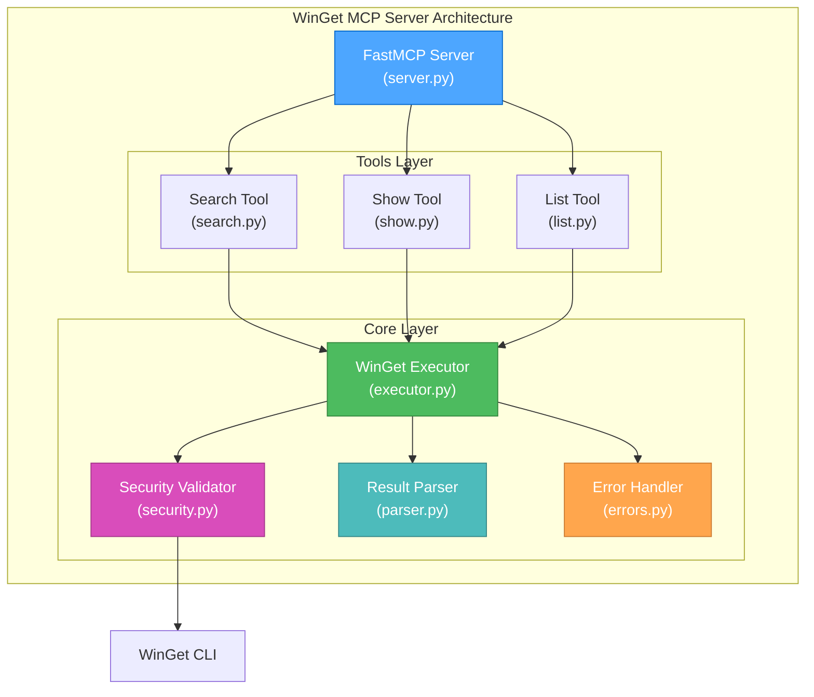

# 🎨🎨🎨 CREATIVE PHASE: ARCHITECTURE DESIGN 🎨🎨🎨

**Focus:** WinGet MCP Server Architecture  
**Objective:** Design a secure, scalable FastMCP server for Windows package management  
**Technology Stack:** Python FastMCP (Corrected from Node.js)  

## CONTEXT & REQUIREMENTS

### System Requirements
- **R1:** MCP Protocol Compliance - Full compatibility with Model Context Protocol v1.9.4
- **R2:** WinGet Integration - Safe execution of Windows Package Manager commands
- **R3:** Security Controls - Prevent arbitrary command execution and validate all inputs
- **R4:** Performance - Efficient command execution with proper error handling
- **R5:** Extensibility - Easy to add new WinGet tools and maintain

### Technical Constraints
- **C1:** Windows Platform - Must work on Windows 10+ with WinGet CLI
- **C2:** Python FastMCP - Use official Python MCP SDK for best support
- **C3:** UV Environment - Leverage Astral UV for dependency management
- **C4:** Command Safety - Only allow approved WinGet commands
- **C5:** Error Handling - Comprehensive error management for robust operation

## COMPONENT ANALYSIS

### Core Components Identified
1. **FastMCP Server Core** - Main MCP server initialization and protocol handling
2. **WinGet Command Executor** - Safe command execution with validation
3. **Tool Registry** - Registration and management of MCP tools
4. **Security Layer** - Input validation and command whitelisting
5. **Result Parser** - Command output processing and formatting
6. **Error Handler** - Comprehensive error management system

### Component Interactions
- **Server Core ↔ Tool Registry** - Tools registered at startup
- **Tool Registry ↔ WinGet Executor** - Tools call executor for WinGet operations
- **WinGet Executor ↔ Security Layer** - All commands validated before execution
- **WinGet Executor ↔ Result Parser** - Raw command output processed
- **All Components ↔ Error Handler** - Centralized error management

## ARCHITECTURE OPTIONS

### Option 1: Monolithic FastMCP Server
**Description:** Single Python file with all functionality integrated directly

**Pros:**
- Simple deployment - single file
- Minimal overhead - no module imports
- Easy debugging - everything in one place
- Fast startup time

**Cons:**
- Poor maintainability - large single file
- Limited extensibility - hard to add new tools
- Testing challenges - difficult unit testing
- Code organization - mixed concerns

**Technical Fit:** Low (violates separation of concerns)  
**Complexity:** Low  
**Scalability:** Low  

### Option 2: Modular FastMCP Architecture
**Description:** Clean separation with dedicated modules for each component

**Architecture:**
```
winget_mcp_server/
├── server.py           # FastMCP server initialization
├── core/
│   ├── __init__.py
│   ├── executor.py     # WinGet command execution
│   ├── security.py     # Input validation & whitelisting
│   ├── parser.py       # Output parsing
│   └── errors.py       # Error handling
└── tools/
    ├── __init__.py
    ├── search.py       # winget search tool
    ├── show.py         # winget show tool
    ├── list.py         # winget list tool
    └── install.py      # winget install tool (if enabled)
```

**Pros:**
- Excellent maintainability - clear separation
- High extensibility - easy to add new tools
- Testable - proper unit testing support
- Professional structure - industry best practices
- Code reusability - shared components

**Cons:**
- More complex setup - multiple files
- Slightly higher overhead - module imports
- More files to manage

**Technical Fit:** High (follows FastMCP best practices)  
**Complexity:** Medium  
**Scalability:** High  

### Option 3: Plugin-Based Architecture
**Description:** Dynamic tool loading with plugin system for maximum extensibility

**Architecture:**
```
winget_mcp_server/
├── server.py           # FastMCP server with plugin loader
├── core/
│   ├── plugin_manager.py  # Dynamic plugin loading
│   └── [same as Option 2]
├── plugins/
│   ├── winget_search/
│   ├── winget_show/
│   └── winget_list/
└── config/
    └── plugins.yaml    # Plugin configuration
```

**Pros:**
- Maximum extensibility - dynamic tool loading
- Configuration-driven - enable/disable tools
- Future-proof - easy to add complex tools
- Enterprise-ready - advanced architecture

**Cons:**
- High complexity - plugin system overhead
- Debugging challenges - dynamic loading issues
- Over-engineering - overkill for current needs
- Higher maintenance - more moving parts

**Technical Fit:** Medium (advanced but may be overkill)  
**Complexity:** High  
**Scalability:** Very High  

## 🎨 CREATIVE CHECKPOINT: ARCHITECTURE EVALUATION

**Progress:** Three architecture options analyzed  
**Decisions:** Evaluating based on project requirements and constraints  
**Next Steps:** Select optimal architecture and create implementation plan  

## ARCHITECTURE DECISION

**Chosen Option:** **Option 2 - Modular FastMCP Architecture**

**Rationale:**
1. **Best Balance** - Provides excellent maintainability without over-engineering
2. **FastMCP Best Practices** - Aligns with official Python MCP SDK patterns
3. **Security Focus** - Clean separation allows robust security implementation
4. **Extensibility** - Easy to add new WinGet tools as needed
5. **Testing** - Proper structure supports comprehensive testing
6. **Future Growth** - Can evolve to plugin-based if needed

## IMPLEMENTATION CONSIDERATIONS

### 1. Server Initialization (server.py)
```python
from mcp.server.fastmcp import FastMCP
from core.security import SecurityValidator
from tools import search, show, list_packages

# Initialize with security validation
mcp = FastMCP("WinGet MCP Server", security_validator=SecurityValidator())

# Register tools
mcp.register_tool(search.winget_search)
mcp.register_tool(show.winget_show) 
mcp.register_tool(list_packages.winget_list)
```

### 2. Security Layer Design
- **Command Whitelisting** - Only allow: search, show, list, info
- **Parameter Validation** - Sanitize all user inputs
- **Output Filtering** - Remove sensitive system information
- **Error Boundaries** - Prevent information leakage

### 3. Tool Implementation Pattern
```python
@mcp.tool()
def winget_search(query: str) -> str:
    """Search for packages using WinGet"""
    # 1. Security validation
    # 2. Command execution  
    # 3. Result parsing
    # 4. Error handling
```

### 4. Error Handling Strategy
- **Graceful Degradation** - Server continues on tool errors
- **User-Friendly Messages** - Clear error descriptions
- **Logging** - Comprehensive error logging for debugging
- **Recovery** - Automatic retry for transient failures

## ARCHITECTURE VISUALIZATION



## VALIDATION

### Requirements Met
- **[✓] R1: MCP Protocol Compliance** - FastMCP handles all protocol details
- **[✓] R2: WinGet Integration** - Dedicated executor with proper CLI integration
- **[✓] R3: Security Controls** - Comprehensive security layer with validation
- **[✓] R4: Performance** - Efficient modular design with async capabilities
- **[✓] R5: Extensibility** - Clean tool structure allows easy additions

### Technical Feasibility: **HIGH**
- Python FastMCP is proven and well-documented
- Modular architecture is industry standard
- WinGet CLI integration is straightforward
- Security patterns are well-established

### Risk Assessment: **LOW-MEDIUM**
- **Low Risk:** Technology stack is mature and supported
- **Medium Risk:** Windows-specific implementation may need platform testing
- **Mitigation:** Comprehensive testing on Windows 10+ environments

🎨🎨🎨 **EXITING CREATIVE PHASE - ARCHITECTURE DECISION MADE** 🎨🎨🎨

**Summary:** Modular FastMCP architecture selected for optimal balance of maintainability, security, and extensibility

**Key Decisions:**
1. **Modular Architecture** - Clean separation of concerns with dedicated modules
2. **Security-First Design** - Comprehensive validation and whitelisting
3. **Tool Pattern** - Standardized tool implementation with @mcp.tool() decorators
4. **Error Strategy** - Graceful degradation with comprehensive error handling

**Next Steps:** 
1. Create detailed security model design
2. Define error handling strategy  
3. Specify tool interface standards
4. Begin implementation phase 